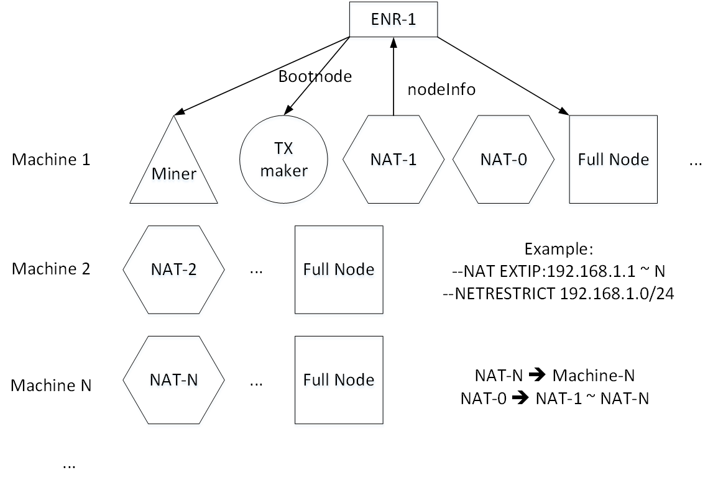

# 大规模实验步骤

## 目标

在模拟以太坊真实环境下（3200-node experiments running in real time on an emulated Ethereum p2p network）获取以下信息：

* 区块信息：返回结果每行为二元组，写入用空格分开（区块大小，交易数量）
* 同步信息：来源为geth.log，包括执行时间与区块同步时间

## 前置条件

* **nodejs + web3@0.20.0 环境**：发交易以及获取区块信息，只需要发交易的机器部署该环境即可
* **geth版本**：v1.9.24（v1.9版本之后都可以，只要不涉及启动参数的大幅更改）
* **golang v1.14**：可用于本机编译
* **集群**：这边的配置是100台机器。保证有基本性能的机器即可，对内存带宽cpu要求不高（一般最低带宽要求是10Mbps*节点数量+100Mbps比较合适）。

## 环境配置

只有负责发交易的节点有nodejs的环境要求，其他没有。

nodejs环境：`sudo apt install nodejs`

查看是否安装了npm：`npm --version`，如果没有安装，则使用：`sudo apt install npm`

新建一个用nodejs完成交互过程的目录：`mkdir web3; cd web3`

在该目录下安装web3包：`npm install web3@^0.20.0`

后续要卸载web3包可以直接删除文件夹

如果要在服务器上编译geth，可以参考前置条件安装版本合适的golang

## 目录树

默认在home/[user]目录下。

``` dir
alias-exp
--> alias
--> native
--> env
------> tc.sh
------> ...
--> txdata
------> maketx.js
------> ...
------> sm_transfer1.json
--> ...

exp
--> alias
------> geth
------> init.sh
------> ...
------> genesis.json
------> data
----------> 00
--------------> keystore
--------------> ...
----------> 01
----------> ...
------> log
----------> 00.log
----------> 01.log
----------> ...
--> native

log[ip-suffix]
--> alias32
------> 00.log
------> ...
--> alias16
--> ...
--> native32
--> ...
```

其中`alias-exp`内装有两个版本的，基于amd 3700X的cpu编译的geth，分别在`alias`和`native`目录下。这两个目录下的geth可以自行编译替换。而`env`目录下是跑私有链的全节点网络所用的必要脚本。另外log目录是后续每台机器留存日志输出的，一开始并不存在，且最后可以用一个总的log目录包含所有的log[ip]目录。

## 脚本功能

geth环境搭建与运行：

* init：构建geth运行的前置环境。即tx maker的生成，并根据tx maker的address对创世块作相应的修改。
* specialrun：对特定节点的启动脚本增添特定参数。包括tx maker和nat节点。
* make：根据设定参数生成节点的启动脚本。
* cluster：为同步用全节点生成集群。
* node：完整配置一个节点的运行环境。主要对象为full节点、miner节点与nat节点。其中full节点的流程为创世块初始化链，通过make生成运行脚本。miner节点在fullnode之上会创建账户用于coinbase。nat节点在fullnode之上则通过specialrun添加nat参数，并运行脚本获取生成enr信息。
* run：批量运行指定id范围的节点。
* scp：发送指定文件到其他ip的机器。注意，目标ip地址写在`ip.txt`文件中（或在脚本中更改参数配置，能修改ip文件名以及目标路径），且发送机与所有接收机都已完成免密登录过程（具体参考expect的脚本仓库）。

> 运行方式：1）需要先初始化tx maker（以生成对应的创世块），调用init =/=> make ==> specialrun。在init和make之间需要先插入本地nat节点的生成，并作为tx maker的bootnode。2）生成nat节点，先输出本机ip地址至extip文件中，再运行node脚本即可（需要先生成新创世块）。3）生成miner节点，直接运行node脚本。4）批量生成全节点，运行cluster即可。



geth交易的发起和区块信息的采集：

* maketx.js：读取json格式的交易数据，通过geth的http（以前名为rpc）接口完成交易的发起。可修改的参数包括：http的port，json交易的文件名，交易的gaslimit。
* extractBlock.js：通过geth的http接口检索区块的大小，内含交易的数量。可修改的参数包括：http的port，检索的起始与终止区块高度，输出文件名。另外可以额外增加需要检索的字段，具体参考geth中getBlock函数（或者源码的`internal/ethapi/api.go`）给出的block的rpcjson结构。

## 非脚本指令

机器时钟同步：

``` shell
sudo apt-get install -y ntpdate
sudo ntpdate -u [clock-server-ip]
```

获取ip地址的命令（无脚本，在geth目录下执行）：

`ip addr show | grep 'inet ' | awk '{print $2}' | sed -n '2p' | cut -d '/' -f1 > extip`

停止所有后台运行的geth：

`killall geth`

查看后台grep进程（id号 | 指令）：

`ps -ef | grep geth | awk '{printf("%s | ", $2); for (i=8;i<=NF;i++) printf("%s ", $i); print ""}'`

清除数据和生成的脚本，恢复初始状态：

``` shell
cd [gethdir]
rm -rf data/* log/*
ls | grep '[0-9]\{2\}\.sh' | xargs rm
rm enr*
```

vim写递增的ip序列：

``` vim
" 打开文件
vim ip.txt

" 递增序列到100
i1[esc]q1yyp[ctrl+A]q98@1

" 补足ip的前缀
:%s/^/10.10.9./g
```

## 实验步骤

**默认当前工作目录都在/home/[user]下，给出单台机器运行32个节点的例子。**

搭建目录树（都是批量操作所有机器）：

1. 通过scp或者github或者gitee拉取alias-exp目录。
2. `mkdir -p exp/alias/log exp/native/log`，由于data目录在初始化区块链时会自动创建，这里可以选择不创。
3. `curip=$(cat exp/alias/extip | cut -d '.' -f4); mkdir -p log$curip/alias32 log$curip/alias16 log$curip/alias8 log$curip/alias4; mkdir -p log$curip/native32 log$curip/native16 log$curip/native8 log$curip/native4`，创建收集输出日志的目录，以ip后缀作为目录后缀，并根据不同节点数量的测试案例分配不同的目录。

提前完成所有机器的ip提取操作（后续操作有关nat节点的都必须有extip文件）：

1. `cd exp/alias`或者`cd exp/native`
2. `ip addr show | grep 'inet ' | awk '{print $2}' | sed -n '2p' | cut -d '/' -f1 > extip`

主机器操作（参考上述网络启动结构图，包含一个总nat节点，一个miner节点以及一个txmaker节点，注意步骤之间也可以加入`ls`以及`vim`指令查看对应内容的变化是否正确）：

1. `cd exp/alias`
2. `bash init.sh 0`
3. `bash node.sh nat 2`
4. `mv enr enr0`
5. `bash node.sh nat 3 enr0`
6. `bash node.sh full 0 enr`
7. `bash specialrun.sh tx 00`
8. `bash node.sh miner 1 enr`
9. `bash cluster.sh 4 31 enr`
10. `bash scp.sh genesis.json`
11. `bash scp.sh enr0`，步骤10和11都是将其他机器所需的**更新后的创世块**以及**总nat节点的boot信息**用`scp`发送过去。

其他机器操作（批量操作剩余机器，注意不要包含主机器，否则会出现覆盖原有脚本和内容的问题）：

1. `cd exp/alias`
2. `bash node.sh nat 0 enr0`
3. `bash cluster.sh 1 31 enr`

运行前务必将所有机器做时钟同步，选一台机器作为同步的标准。具体操作参考上述的「非脚本指令」。

开始运行私链的网络：

1. `cd exp/alias`
2. `nohup bash run.sh 0 31`

查看私链情况（主机器中01是miner，00是txmaker，其他机器编号随意，都能看相关信息，但出块只能主机器的01或00出）：

1. `cd exp/alias`
2. `./geth attach data/01/geth.ipc`，与geth命令台连接。
3. `net.peerCount`查看peer节点数量，一般是50-150之间。`eth.blockNumber`查看区块高度。`miner.start(1);admin.sleepBlocks(15);miner.stop()`可以让miner出大约20个块（数字15不一定精确）。`txpool.status`可以查看交易池的状态。

发送交易与收集区块信息（主机器）：

1. `cd web3`
2. `node maketx.js`或`node extractBlock.js`，注意需要到js脚本中修改相应的参数，包括`port`口，输入/输出文件名，区块范围等。其中输入的文件需要将json格式的交易信息事先准备好。

拷贝日志（所有机器）：

1. `cp exp/alias/log/* log$(cat exp/alias/extip | cut -d '.' -f4)/alias32/`

由于可以首次就跑32个节点，后续跑同样版本geth（alias或native）的16/8/4节点时可以直接复用之前生成的启动脚本，在原有的链上继续发交易和出块。不过需要先删掉日志信息（当然得先将日志信息拷贝出去），避免重复。

1. `cd exp/alias`
2. `rm log/*`
3. `nohup bash run.sh 0 15`，后续操作是一样的。
